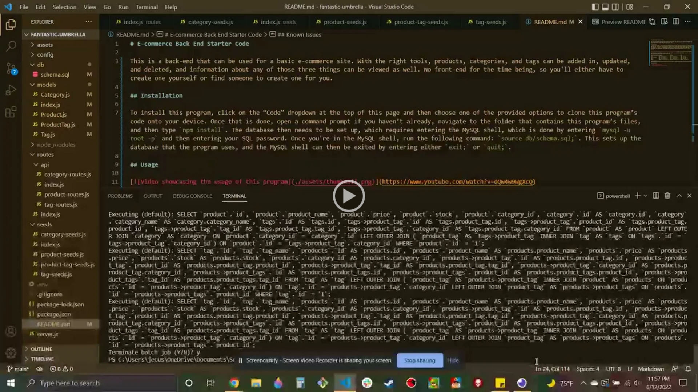

# E-commerce Back End Starter Code

This is a back-end that can be used for a basic e-commerce site. With the right tools, products, categories, and tags can be added in, updated, and deleted, and information about any of those three things can be viewed as well. No front-end for the time being, so you'll either have to create one yourself or find someone to create one for you.

## Installation

To install this program, click on the “Code” dropdown at the top of this page and then choose one of the provided options to clone this program’s code onto your device. Once that is done, open a command prompt if you haven’t already, navigate to the folder that contains this program’s files, and then type `npm install`. The database then needs to be set up, which requires entering the MySQL shell, which is done by entering `mysql -u root -p` and then entering your SQL password. Once you're in the MySQL shell, run the following command: `source db/schema.sql;`. This sets up the database that the program uses, and the MySQL shell can then be exited by entering either `exit;` or `quit;`.

## Usage

Once everything in the previous section is done, this program can be initiated by entering `npm start`. This back-end is then accessible by using your perferred API client. API routes are as follows:

Item → Action ↓ | Category                     | Product                    | Tag
--------------------|------------------------------|----------------------------|------------------------
View                | GET `/api/categories`        | GET `/api/products`        | GET `/api/tags`
View individual     | GET `/api/categories/:id`    | GET `/api/products/:id`    | GET `/api/tags/:id`
Add                 | POST `/api/categories`       | POST `/api/products`       | POST `/api/tags`
Update              | PUT `/api/categories/:id`    | PUT `/api/products/:id`    | PUT `/api/tags/:id`
Delete              | DELETE `/api/categories/:id` | DELETE `/api/products/:id` | DELETE `/api/tags/:id`

## Known Issues
When viewing products or tags, the tag data for products and the product data for tags is not properly displayed.

## Contributors

* JEC6789: models, API routes
* Xandromus: anything else I didn't mention